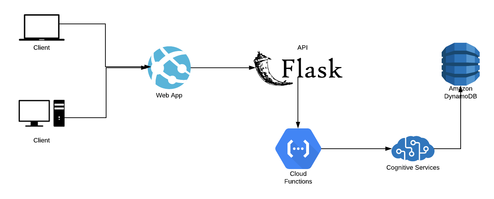

# Proyecto-Aprendizaje-Automatico

Orientaciones para la evaluación del segundo parcial para la materia de aprendizaje automático.

## Planteamiento del problema
En las tiendas para aplicaciones móviles como son la app store y la play store hay millones de aplicaciones, y puede ser difícil saber como triunfar y tener éxito en un mercado tan competitivo y transitado como este. Por lo que es importante estar al tanto de las tendencias.

## Definición del proyecto
Plataforma web que presenta datos relacionados a las aplicaciones más concurridas actualmente así como sus tendencias, con el uso de procesos de machine learning para la comparación con un dataset, que permita la representación de etiquetas importantes para la predicción del éxito de una aplicación..

## Objetivo general 
El objetivo que se espera cumplir es el sintetizar grandes cantidades de información que permita extraer datos relevantes para encontrar patrones e información adicional que permita a los desarrolladores crear aplicaciones con más impacto en los clientes.

## Cómo se resolverá el problema
Mediante el uso de “Machine Learning” e Inteligencia Artificial se resuelve el problema encontrando datos importantes y relevantes que  ayuden a encontrar ciertos patrones y definir ciertas etiquetas, para presentar información relevante para el cliente y el desarrollo de su aplicación, además de definir las tendencias en el mercado actual del mercado de aplicaciones.

## Tecnologías a utilizar
* Se pretende hacer un front end en React Js, un back end utilizando servicios de Azure y de AWS, tanto el procesamiento y entrenamiento de algoritmos de ML como almacenamiento de datos (Base de datos)
* Para el análisis y extracción de datos para la aplicación se pretende utilizar python y sus librerías para una mejor interpretación
* Para consumir los datos mencionados en el punto anterior se pretende utilizar y crear un REST API para acceder a los datos procesados
* Dashboard dividido en dos segmentos, del lado izquierdo un menú para selección de categorías y del lado derecho se visualizarán los datos y la interpretación de los mismos. Las categorías que podrá seleccionar el usuario son:
    * Apps más descargadas por mes (opción para seccionar por semana, año, y de por vida)
    * Géneros de apps más descargados por mes (opción para seccionar por semana, año, y de por vida)
    * Apps mejor rankeadas por mes (opción para seccionar por semana, año, y de por vida)

## Arquitectura de la solución

## Ejecutar la solución de forma local con Docker

1. Ejecuta el Api siguiendo las instrucciones del Readme dentro de la carpeta API
2. Ejecuta el Frontend en React siguiendo las instrucciones del Readme dentro de la carpeta frontend-react

## Aplicación en la nube
* Aplicación: https://master.d3oe360fmm7c9k.amplifyapp.com/
* API: https://apistudentexchange.azurewebsites.net/

## Referencias
* [Dataset Play Store](https://www.kaggle.com/lava18/google-play-store-apps)
* [Dataset App Store](https://www.kaggle.com/ramamet4/app-store-apple-data-set-10k-apps)
* [Trending Topics](https://www.kaggle.com/hwassner/trending-topics)
